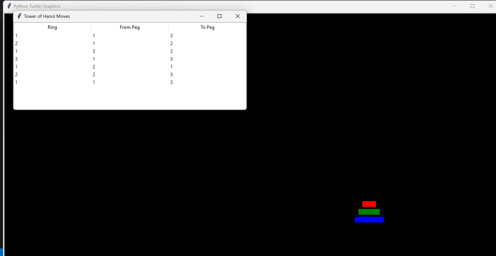

<h1>Tower of Hanoi with Turtle and Tkinter</h1>

The Tower of Hanoi is a classic mathematical puzzle that consists of three rods and a number of disks of different sizes, which can slide onto any rod. The puzzle starts with the disks stacked in ascending order of size on one rod, the smallest at the top, making a conical shape.

The objective of the puzzle is to move the entire stack of disks to another rod, obeying the following simple rules:

<ol>
    <li>Only one disk can be moved at a time.</li>
    <li>Each move consists of taking the upper disk from one of the stacks and placing it on top of another stack or on an empty rod.</li>
    <li>No disk may be placed on top of a smaller disk.</li>
</ol>

The minimum number of moves required to solve a Tower of Hanoi puzzle with <em>n</em> disks is \(2^n - 1\).

The puzzle is often used to teach recursive algorithms due to its recursive nature. The recursive solution involves three steps:

<ol>
    <li>Move <em>n-1</em> disks from the source rod to the auxiliary rod.</li>
    <li>Move the <em>n-th</em> disk from the source rod to the destination rod.</li>
    <li>Move the <em>n-1</em> disks from the auxiliary rod to the destination rod.</li>
</ol>

<h2>Features</h2>
<ul>
    <li>Visualization of the Tower of Hanoi puzzle with customizable number of rings.</li>
    <li>Interactive move input using dialogs.</li>
    <li>Step-by-step visualization of moves.</li>
    <li>Display of move history in a Tkinter Treeview.</li>
</ul>

<h2>How to Use</h2>

Make sure you have Python installed on your system. Clone the repository and follow these steps:

<pre><code>git clone https://github.com/yourusername/tower-of-hanoi.git
cd tower-of-hanoi
python tower_of_hanoi.py
</code></pre>

<h2>Screenshots</h2>

<h2>Contributing</h2>

Contributions are welcome! If you find any issues or want to enhance the project, feel free to create a pull request.The first main problem for me is When i draw pillar, rings gets vertical instead of horizontal

    
Feel free to fork this project and submit pull requests with improvements or new features.

    
   <h2>License</h2>
    
This project is licensed under the MIT License. See the <a href="https://opensource.org/licenses/MIT">LICENSE</a> file for details.

    
</body>
</html>
